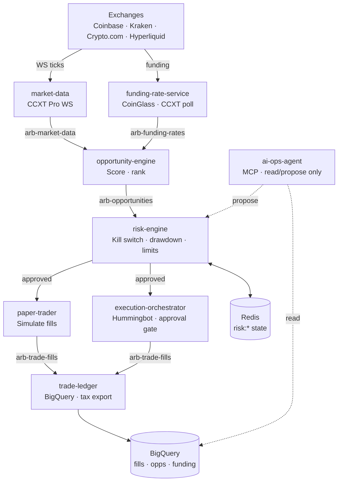

# Crypto Arbitrage System

Production-grade, GCP-native crypto arbitrage platform. Eight Python 3.12
microservices on Cloud Run, talking exclusively over Pub/Sub, with Terraform
infra, an MCP-based AI ops agent (read/propose-only), and a single-file ops
dashboard.

## Architecture



See `docs/ARCHITECTURE.md` for full data-flow and ownership invariants.

## Quickstart

1. **Clone & configure**
   ```bash
   git clone <repo-url> traditbot && cd traditbot
   gcloud config set project <your-gcp-project>
   gcloud auth application-default login
   ```

2. **Provision secrets** (per-exchange API keys, READ + TRADE scopes only —
   never withdrawals)
   ```bash
   gcloud secrets create coinbase-api-key  --replication-policy=automatic
   gcloud secrets create coinbase-api-secret --replication-policy=automatic
   # repeat for kraken, crypto-com, hyperliquid, coinglass
   echo -n "$KEY" | gcloud secrets versions add coinbase-api-key --data-file=-
   ```

3. **Stand up infra** (Pub/Sub, Cloud Run, BigQuery, Memorystore, monitoring)
   ```bash
   cd infra/terraform/environments/dev
   terraform init && terraform apply
   # for prod: cd ../prod && terraform apply
   ```

4. **Start in paper-trading mode** (default — no real orders placed)
   ```bash
   # Cloud Run revisions deploy via GitHub Actions on push to main.
   # Local smoke test:
   PYTHONPATH=.:services/risk-engine uvicorn services.risk-engine.main:app --port 8080
   ```

5. **Validate** (run the full test matrix; CI does this on every PR)
   ```bash
   PYTHONPATH=.:services/risk-engine          python3 -m pytest services/risk-engine/tests/ -q
   PYTHONPATH=.:services/paper-trader         python3 -m pytest services/paper-trader/tests/ -q
   PYTHONPATH=.:services/market-data          python3 -m pytest services/market-data/tests/ -q
   PYTHONPATH=.:services/funding-rate-service python3 -m pytest services/funding-rate-service/tests/ -q
   PYTHONPATH=.:services/opportunity-engine   python3 -m pytest services/opportunity-engine/tests/ -q
   PYTHONPATH=.:services/trade-ledger         python3 -m pytest services/trade-ledger/tests/ -q
   PYTHONPATH=.:services/ai-ops-agent         python3 -m pytest services/ai-ops-agent/tests/ -q
   ```

6. **Go live** (only after at least 30 days of paper-trading match expected PnL)
   - Flip `MODE=live` in Cloud Run env (paper-trader stays running in shadow).
   - Approve first real opportunity via the Slack-tied execution-orchestrator
     gate — there is no UI bypass.
   - Watch the dashboard (`dashboard/index.html`) for drawdown and latency.

## Risk policy (summary)

Full policy in `docs/RISK_POLICY.md`.

- **risk-engine is the choke point.** Every opportunity — paper or live — must
  pass risk-engine. Order of checks: kill switch → position limits → drawdown
  → exchange health. A drawdown breach trips the kill switch synchronously.
- **Kill switch reset requires a token** (`KILL_SWITCH_RESET_TOKEN`). No UI
  bypass; ops must use the documented endpoint.
- **Withdrawals are hard-blocked** at the AI permission layer
  (`PermissionLevel.NEVER` in `services/ai-ops-agent/permissions.py`).
- **BigQuery has a single writer**: `trade-ledger`. Every other service is
  read-only against BQ. Enforced by `test_ledger_no_bigquery_import`.
- **Net-edge math has a single source of truth**:
  `shared/utils/fee_calculator.py#calculate_net_edge`. Strategies must not
  reimplement spread/fee/slippage/buffer math.

## AI ops setup

The `ai-ops-agent` service exposes an MCP server. Read-only ops are
autonomous; risk-limit or trade-size changes are **propose-only** and require
Slack approval; withdrawals / leverage increases are **hardcoded blocked**.

Wire to Claude Desktop or Cursor:
```json
{
  "mcpServers": {
    "arb-ops": {
      "url": "https://ai-ops-agent-<hash>-uc.a.run.app/mcp",
      "headers": { "Authorization": "Bearer ${OPS_AGENT_TOKEN}" }
    }
  }
}
```

See `docs/STRATEGY_GUIDE.md` for the per-tool permission table.

## Documentation

- `docs/ARCHITECTURE.md` — full data-flow, service ownership, invariants
- `docs/STRATEGY_GUIDE.md` — strategies and net-edge math
- `docs/RISK_POLICY.md` — limits, kill switch, drawdown
- `docs/EXCHANGE_FEES.md` — per-venue taker fees and quirks
- `docs/TAX_COMPLIANCE.md` — wash-sale, FIFO/HIFO, tax export endpoint
- `CLAUDE.md` — agent-facing repo guide

## License & contributing

Source-available; see `LICENSE`. Contributions: fork, open PR against `main`,
rebase before merge. CI must be green (lint + tests + `terraform validate`).
Never bypass pre-commit hooks. Never hardcode topic names — extend the
`Topic` enum in `shared/pubsub/publisher.py`.
